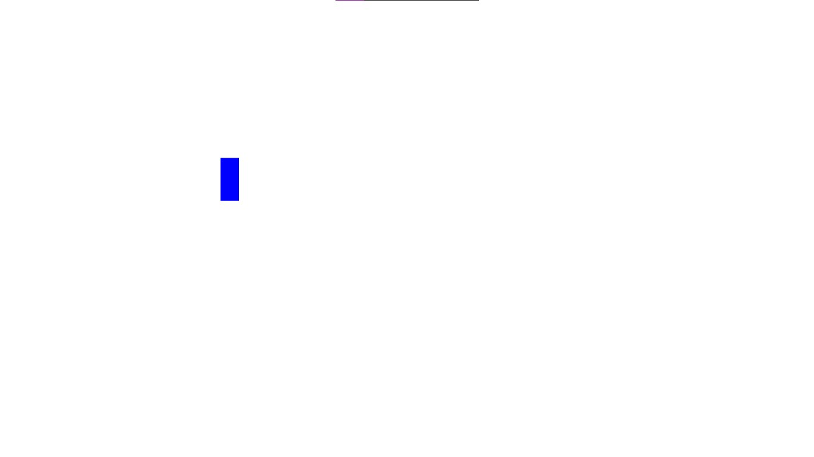
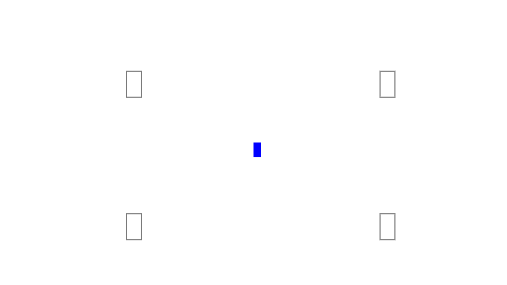
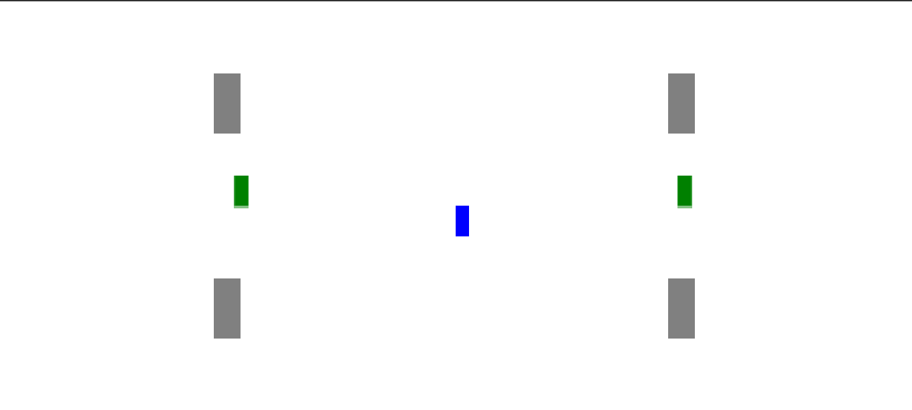

# Dia a Dia

Aqui fiz uma listagem das adições que fui realizando no projeto (não fiz as adições a cada dia)

## Dia 1

- Criação do canvas;
- Criação do personagem;
- Movimentação do personagem;
- Colisão com o canvas;

## Dia 2

- Criação dos pilares do mapa;
- Colisão com os pilares;

## Dia 3

- Remodelando todo o projeto para aplicar conhecimentos de OO;
- Criação da Classe BoxHead para gerenciar os objetos do game;
- Criação dos Spawners e Zombies;

